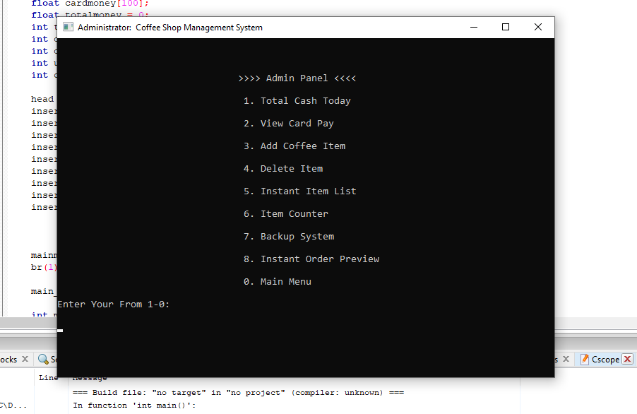

# Coffee-Shop-System-using-C

The Coffee Shop System with Source Code is a project that can manage the listing of your coffee product. The system can help you manage the listing your coffee products by entering such as Serial ID Coffee Name, Price, Quantity. The purpose of the system is to produce an efficient coffee that can satisfy the customer need with the help of the modernize transaction.

# About the System
The Coffee Shop System was created in a simple console application, the system is protected by a strict login security, in order for you to access the system you need to enter a correct password information. The user can do many in the system in the system, he/she can add new Coffee Detail, View Coffee List, Edit Current Coffee. The system can provide all you need for managing your coffee product, it can help you lessen the workload of your employee by an automatic transaction. This system uses simple CRUD function that can organize and manage the list by adding and deleting the current coffee. The Coffee Shop System was built as a basic coding structure of C that help to teach new beginners...

# Features:
* Total Cash
* View Card Pay
* Add Coffee Item
* Delete Item
* Instant Item List
* Item Counter
* Backup
* Instant Order Preview

# Installation:
1. Extract the zip file.
2. Open the extracted folder
3. Locate the c file.
4. Then open the file via codeblocks or any IDE's that can run C++ file.
5. Then click run and build.

# User Login Information
Password: 12345

# FOR YOUR OWN SAFETY, PLEASE:

1. Re-scan downloaded files using your personal virus checker before using it.
2. NEVER, EVER run compiled files (.exe's, .ocx's, .dll's etc.)--only run source code.
